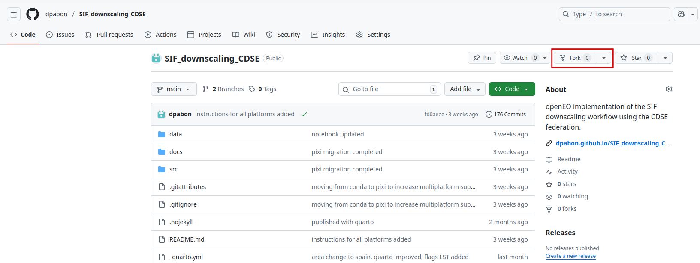

# Sun Induced Fluroscence Downscaling processor using openEO and Copernicus Data Space Ecosystem Infrastructure

## Description


TBD


## Tutorial

You can run the processor following the [tutorial](https://dpabon.github.io/SIF_downscaling_CDSE/) (We recommend [Positron](https://positron.posit.co/) as it included all the batteries needed) 

- First you need to install pixi:

https://pixi.sh/latest/

- In positron set pixi tool path:

To check where pixi was installed you can run in a terminal

Linux and Mac:
```whereis pixi```

Windows:
```where pixi```

and copy paste the path into Positron settings "Python: Pixi Tool Path".

- You need to fork this github repository on github (This step is necessary as currently CDSE is not able to perform upsample operations. Then a spatial upsampling needs to run locally, upload to github and load the results in the CDSE again):



Then clone the repo into your local machine:

```git clone https://github.com/your_user_name/SIF_downscaling_CDSE```

- Then install the dependencies using pixi:

```cd SIF_downscaling_CDSE```

```pixi install```

Now you have everything setup to run the [tutorial](https://dpabon.github.io/SIF_downscaling_CDSE/), Don't forget to select the pixi python interpreter before running.


- ```openEO_sif_downscaling.py``` contains the active development of the SIF downscaling workflow using openEO.
- ```udf.py``` contains the User Defined Function need it for openEO.
- ```environment.yml``` contains the conda environment with all the packages need it to reproduce the analysis.
- ```data``` contains a COG file and the corresponding geojson STAC.


## FAQ

- Q: Problems to run the tutorial?

A: Please open an [issue](https://github.com/dpabon/SIF_downscaling_CDSE/issues/new) 

- Q: Can I select a new area to apply the procesor?
 
A: Sure, just change the values in the area of interest cell

- Q: Why pixi if everyone is using coda-forge?

A: Mainly because of convenience. pixi allows to easily create workspace for multiple platforms (the ones for this project include "linux-64", "win-64", "osx-64", "osx-arm64").

- Q: How can I contribute?

A: clone this repository and create pull requests.


## Acknowledgement


This project has received funding from the [Open-Earth-Monitor Cyberinfrastructure](https://earthmonitor.org/) project that is part of European Union's Horizon Europe research and innovation programme under grant [101059548](https://cordis.europa.eu/project/id/101059548).